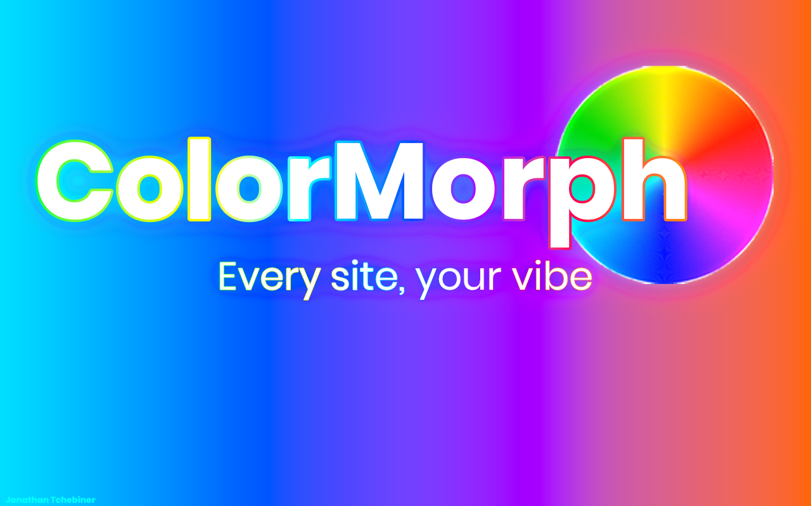
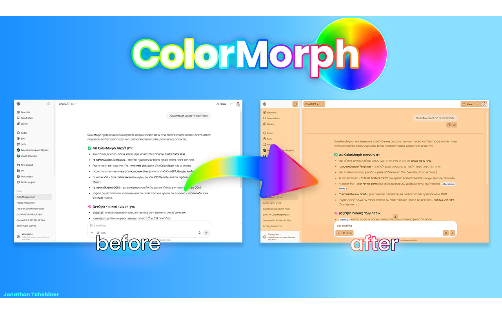
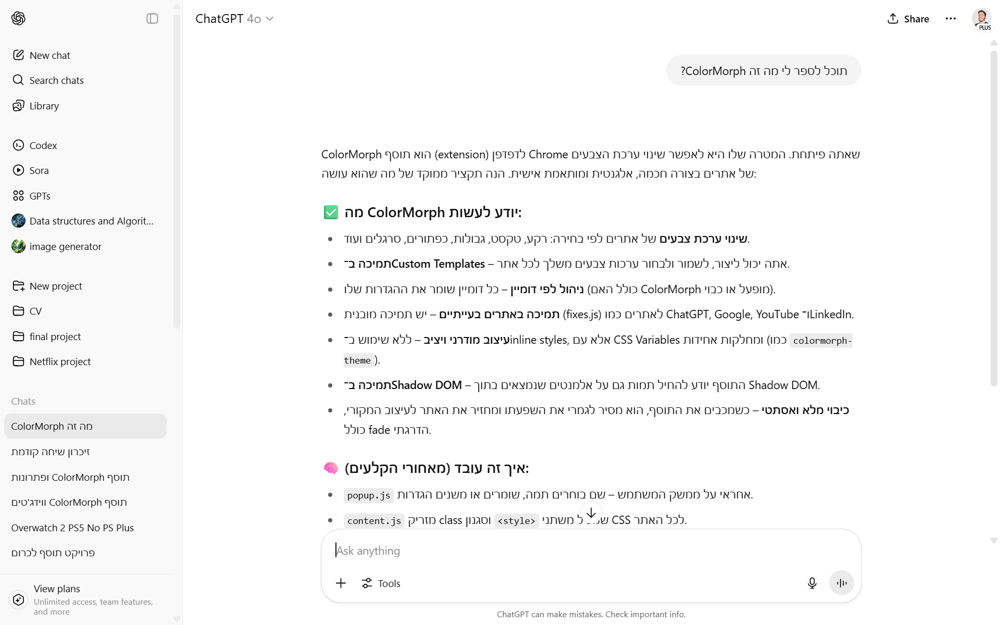
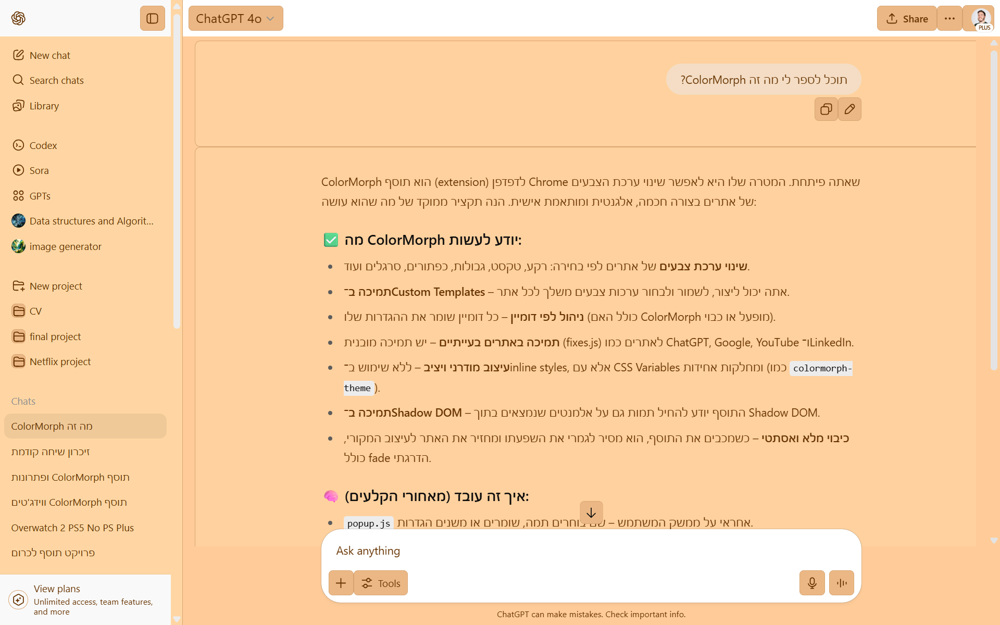
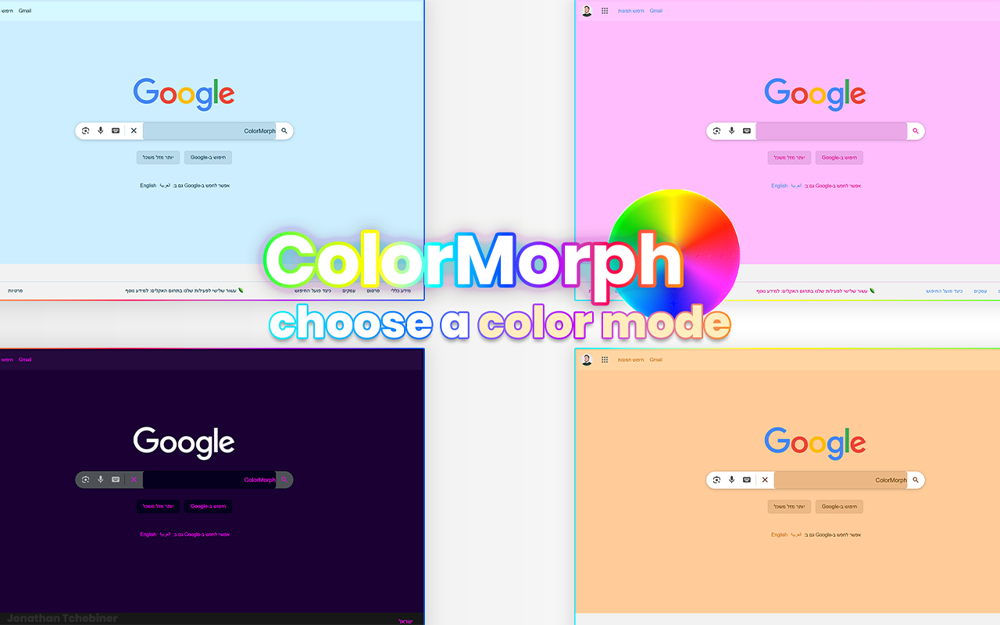
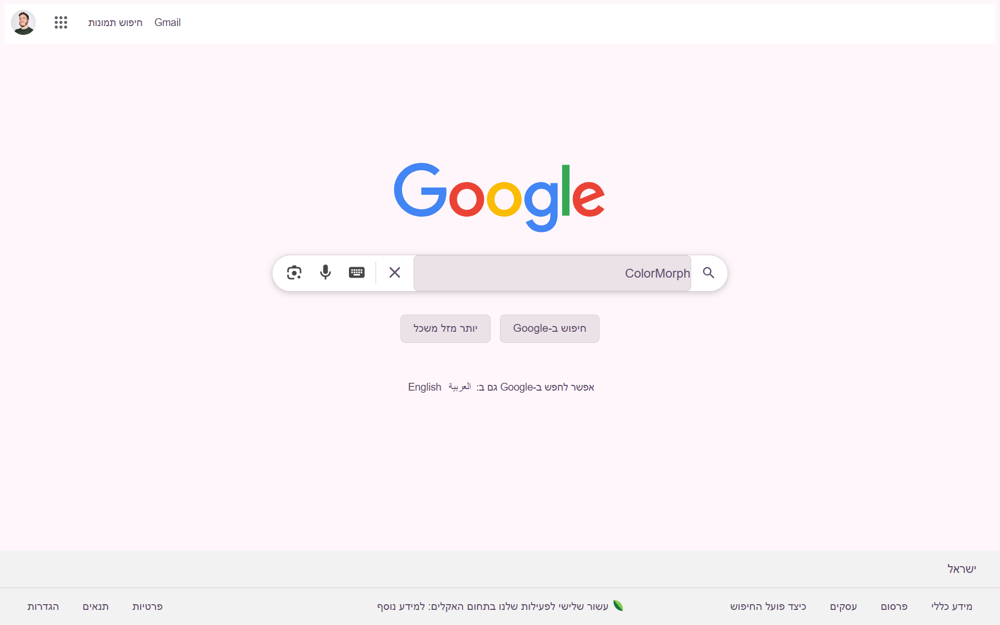
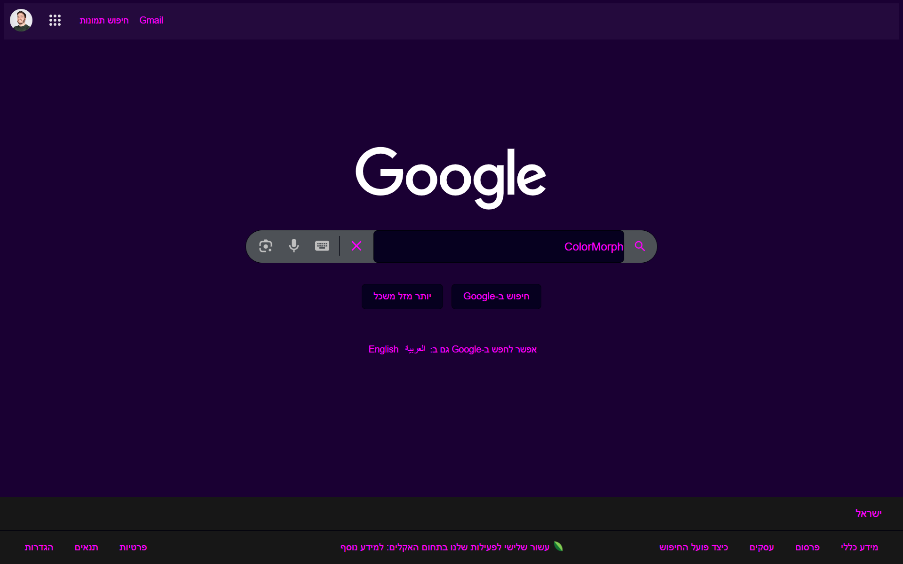
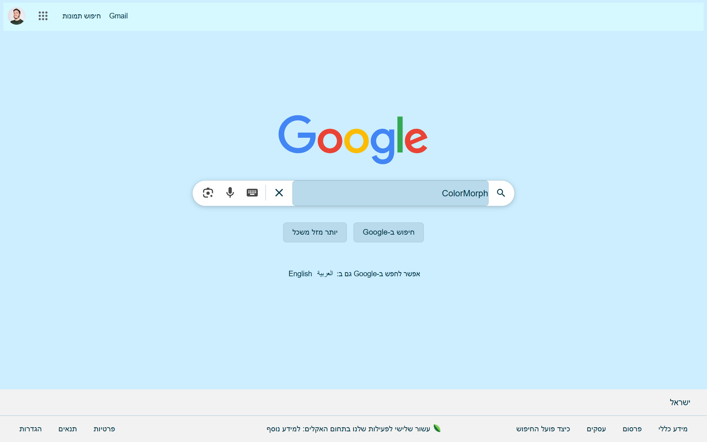
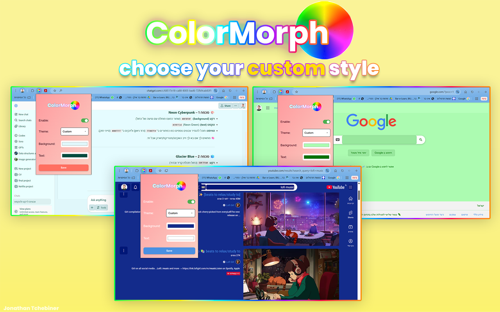

# ColorMorph

**ColorMorph** is a lightweight Chrome extension that lets you customize the appearance of any website with your own color themes — or choose from our curated presets.

- Change background & text colors
- Pick from beautiful built-in themes
- Design your own palette per site
- Save, switch, and manage color modes easily

---

## Features

- 10+ premade themes (e.g., Pastel, Cyberpunk, Ocean, Nightmode)
- Fully custom color creation
- On/off toggle per site
- Saves your settings locally
- Fast, smooth and responsive

---

## Screenshots

### Logo


---

### Before / After




| Original | Modified with ColorMorph |
|----------|--------------------------|
|  |  |

---

### Built-in Themes


<p float="left">
  
  
  
</p>

---

### Custom Themes

Design your own styles:



---

##  Installation (Not Available Yet)

Install from the [Chrome Web Store](https://chromewebstore.google.com/detail/colormorph/effbldihnfhhenknincnfikkigjnnbai)  
Or manually:

```bash
git clone https://github.com/yonimomi9/colormorph.git
